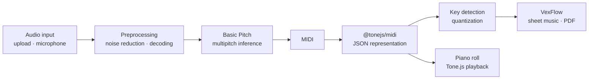

<div align="center">

# Armonía

### Automatic Music Transcription from Audio to MIDI and Sheet Music

A browser-based Music Information Retrieval (MIR) pipeline that transcribes polyphonic audio into symbolic music and renders it as engraved notation and an interactive piano roll.


[Abstract](#abstract) · [Pipeline](#pipeline) · [Modules](#functional-testing-modules) · [Getting Started](#getting-started) · [Limitations](#limitations) · [References](#references)

</div>

---

## Abstract

**Automatic Music Transcription (AMT)** is the task of converting an audio signal into a symbolic representation of the notes it contains. It is a central problem in **Music Information Retrieval (MIR)**, with applications in music education, analysis, and composition.

Armonía is an end-to-end, single-user transcription system developed as a thesis project. It combines a neural multipitch estimator, [Spotify's Basic Pitch](https://github.com/spotify/basic-pitch), served through a local **FastAPI** backend, with a client-side stack that parses, analyzes, and visualizes the result entirely in the browser: MIDI parsing with `@tonejs/midi`, tonal key estimation, score engraving with **VexFlow**, and a falling-notes piano roll synchronized with **Tone.js** playback.

The repository is organized as a monorepo of **isolated, numbered test applications**. Each one validates a single stage of the pipeline in isolation before it is integrated into the final frontend, which keeps every stage reproducible and independently deployable.

### Objectives

- Provide isolated test applications for each stage of the pipeline to guarantee reproducibility.
- Integrate **Basic Pitch** through a local FastAPI backend for audio-to-MIDI conversion.
- Use **Tone.js** (`@tonejs/midi`) to parse MIDI into a JSON representation suitable for client-side editing and rendering.
- Render sheet music with **VexFlow**, including key signatures, accidentals, rests, and PDF export.
- Visualize MIDI interactively with a **falling-notes piano roll** player.
- Maintain a modular architecture with responsive design and consistent documentation.

---

## Pipeline



| Stage             | Task                                  | Technique / Tooling                                              |
| ----------------- | ------------------------------------- | ---------------------------------------------------------------- |
| Audio acquisition | Capture or load an audio signal       | `MediaRecorder` API, drag-and-drop upload                        |
| Preprocessing     | Reduce noise and normalize input      | Web Audio API, `OfflineAudioContext`, `imageio-ffmpeg`           |
| Transcription     | Estimate note events from audio       | Spotify Basic Pitch (ONNX runtime)                               |
| Symbolic parsing  | Convert MIDI into editable structures | `@tonejs/midi`                                                   |
| Key estimation    | Detect the tonality of the piece      | Krumhansl–Kessler pitch-class profiles weighted by note duration |
| Quantization      | Align note events to a rhythmic grid  | 16th-note grid, chords and rests resolved per measure            |
| Notation          | Engrave the score                     | VexFlow (SVG), Bravura and Academico fonts                       |
| Visualization     | Inspect notes over time               | Canvas piano roll with Tone.js `PolySynth` playback              |

---

## Functional Testing Modules

Every module is deployed independently and validates one stage of the workflow.

| Stage          | Module                     | Description                                                                                                               | Demo                                                       |
| -------------- | -------------------------- | ------------------------------------------------------------------------------------------------------------------------- | ---------------------------------------------------------- |
| Acquisition    | **Audio Recording**        | Microphone capture with real-time waveform, playback, and download                                                        | [Open](https://thesis-audio-recording.netlify.app/)        |
| Acquisition    | **Audio Upload**           | Drag-and-drop upload, dynamic audio list, and format badges (MP3, WAV, OGG, FLAC, AAC, WebM, M4A)                         | [Open](https://thesis-audio-upload.netlify.app/)           |
| Preprocessing  | **Audio Cleaning**         | In-browser noise reduction with the Web Audio API: white noise, background noise, and distortion repair, exported as WAV  | [Open](https://thesis-audio-cleaning.netlify.app/)         |
| Symbolic data  | **MIDI to JSON**           | MIDI parser and editor built on `@tonejs/midi`: edit BPM, time signature, and note properties, then export back to `.mid` | [Open](https://thesis-midi-to-json.netlify.app/)           |
| Notation       | **VexFlow**                | Engraving reference: staves, notes, beams, ties, modifiers, guitar tabs, and barlines, with PDF export                    | [Open](https://thesis-vexflow.netlify.app/)                |
| Notation       | **JSON to VexFlow**        | Converts Tone.js JSON into engraved sheet music with key detection, responsive layout, and paginated PDF export           | [Open](https://thesis-json-to-vexflow.netlify.app/)        |
| Integration    | **Fetching Local Backend** | Client for the FastAPI and Basic Pitch backend: upload, recording, per-item conversion, and MIDI download                 | [Open](https://thesis-fetching-local-backend.netlify.app/) |
| Visualization  | **Piano Roll JSON Player** | Canvas falling-notes piano roll synchronized with a rendered keyboard and Tone.js playback                                | [Open](https://thesis-piano-json-player.netlify.app/)      |
| Final frontend | **Final Frontend Design**  | Design system and component scaffold for the unified application                                                          | [Open](https://thesis-final-frontend.netlify.app/)         |

---

## Technical Notes

### Transcription model

Transcription is performed by **Basic Pitch**, a lightweight, instrument-agnostic neural network for polyphonic note transcription and multipitch estimation developed by Spotify's Audio Intelligence Lab (Bittner et al., ICASSP 2022). The backend runs it through the **ONNX** runtime, which avoids a TensorFlow dependency and keeps inference CPU-only.

| Component         | Version                                                           |
| ----------------- | ----------------------------------------------------------------- |
| `basic-pitch`     | `X.Y.Z` <!-- replace with the output of: pip show basic-pitch --> |
| Inference runtime | ONNX (`basic-pitch[onnx]`)                                        |
| Python            | 3.11                                                              |

Basic Pitch resamples input audio to 22,050 Hz and downmixes it to mono before analysis. It performs best on a single instrument at a time.

### Key detection

The tonality of a piece is estimated with the **Krumhansl–Kessler** algorithm: a 12-bin pitch-class histogram, weighted by note duration, is correlated against the major and minor key profiles rotated through all 12 tonics. The best match determines the key signature, and the number of accidentals selects sharp or flat spelling for every note.

### Quantization and engraving

Note onsets and durations are snapped to a 16th-note grid and grouped by measure. Simultaneous onsets become chords, gaps become rests, and durations are mapped to the nearest standard note value. Accidentals are derived from MIDI note numbers and not from note-name strings, which avoids ambiguity when spelling flats. The PDF export re-renders the score at a fixed width on A4 landscape and paginates it by whole staff lines.

---

## Limitations

- **Single-voice notation.** Polyphony is simplified into one voice per rhythmic slot. Independent voices, multiple staves, and ties across measures are not modeled yet.
- **Rhythmic quantization.** A fixed 16th-note grid does not represent tuplets or expressive timing faithfully.
- **Transcription accuracy.** Results depend on Basic Pitch and on recording quality. Dense polyphony and multi-instrument mixtures reduce accuracy.
- **No quantitative evaluation yet.** The pipeline has been validated functionally, not benchmarked with standard AMT metrics such as note-level precision, recall, and F-measure.
- **Single-user scope.** The system has no authentication, persistence, or concurrency handling; it is scoped as a thesis demonstration.

---

## Getting Started

### Frontend modules

Every module is a standalone React + Vite application.

```bash
cd <module-folder>
npm install
npm run dev
```

### Transcription backend

The backend requires **Python 3.11**.

```bash
py -3.11 -m venv .venv
source .venv/Scripts/activate        # Windows (Git Bash)
pip install "basic-pitch[onnx]" fastapi uvicorn
uvicorn app.main:app --reload
```

Once the backend is running, the integration modules connect to it through the status indicator shown in their interface.

### Deployment

| Layer                 | Target                     |
| --------------------- | -------------------------- |
| Frontend modules      | Netlify                    |
| Transcription backend | Google Cloud Run (planned) |

---

## Related Work and Tools

- [**Basic Pitch**](https://github.com/spotify/basic-pitch): the transcription model used by this project.
- [**WaveRoll**](https://github.com/crescent-stdio/wave-roll): comparative visualization and synchronized playback of multiple MIDI piano rolls in the browser (ISMIR 2025).
- [**MIDI Toolbox**](https://miditoolbox.com/player): free browser-based MIDI player, editor, and transposition tool.

---

## References

If you use this work, please also cite the transcription model.

```bibtex
@inproceedings{2022_BittnerBRME_LightweightNoteTranscription_ICASSP,
  author    = {Bittner, Rachel M. and Bosch, Juan Jos\'e and Rubinstein, David and Meseguer-Brocal, Gabriel and Ewert, Sebastian},
  title     = {A Lightweight Instrument-Agnostic Model for Polyphonic Note Transcription and Multipitch Estimation},
  booktitle = {Proceedings of the IEEE International Conference on Acoustics, Speech, and Signal Processing (ICASSP)},
  address   = {Singapore},
  year      = {2022}
}
```

```bibtex
@inproceedings{waveroll2025,
  title     = {WaveRoll: JavaScript Library for Comparative MIDI Piano-Roll Visualization},
  author    = {Park, Hannah and Jeong, Dasaem},
  booktitle = {Proceedings of the 26th International Society for Music Information Retrieval Conference (ISMIR)},
  year      = {2025}
}
```

Krumhansl, C. L., & Kessler, E. J. (1982). Tracing the dynamic changes in perceived tonal organization in a spatial representation of musical keys. _Psychological Review, 89_(4), 334–368.

---

## Academic Context

Thesis project, Universidad de la Costa CUC. Advisor: Mauricio Barrios Barrios.

## License

Released under the [Apache License 2.0](LICENSE). You may use, modify, and distribute the code with proper attribution.

<div align="center">

Built with ♥ by Jesús Domínguez · [@jdomingu19](https://github.com/jdomingu19/)

</div>
